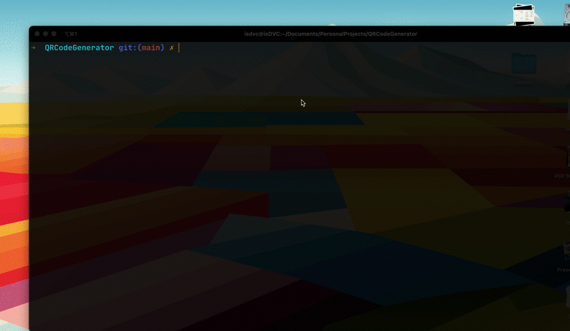

# BoneyQR

BoneyQR is a simple command-line interface (CLI) tool for generating QR codes from text input. It utilizes the ZXing library and provides various options for customizing the output QR code image.

## Table of Contents
- [Prerequisites](#prerequisites)
- [Installation](#installation)
- [Usage](#usage)
- [Options](#options)
- [Examples](#examples)
- [Dependencies](#dependencies)
- [Contributing](#contributing)
- [License](#license)
- [Contact](#contact)
- [Acknowledgements](#acknowledgements)

## Prerequisites
- Java 17 or later
- Maven 3.9.6 or later

## Installation
1. Clone the repository:
```
git clone https://github.com/dvc-77/QRCodeGenerator.git
```
2. Navigate to the project directory:

``` cd QRCodeGenerator```
3. Build the project using Maven:

```mvn clean install```

## Usage

```java -jar target/bqr-jar-with-dependencies.jar [OPTIONS] <text>```

## Options
- `-v`, `--verbose`: Enable verbose output for more detailed information.
- `-s`, `--size`: Specify the size of the QR code image (default: 200).
- `-f`, `--format`: Set the image format for the QR code (default: png).
- `-d`, `--directory`: Specify the output directory for the generated QR code image.
- `-o`, `--output-name`: Set the name of the output file for the QR code image.

## Running Locally


## Examples
1. Generate a QR code with default settings:

```java -jar target/bqr-jar-with-dependencies.jar "https://example.com"```
2. Generate a QR code with custom size and format:

```java -jar target/bqr-jar-with-dependencies.jar -s 300 -f jpg "https://example.com"```

3. Generate a QR code with a specific output directory and file name:

```java -jar target/bqr-jar-with-dependencies.jar -d /path/to/output -o my_qrcode "https://example.com"```

## Dependencies
- [ZXing](https://github.com/zxing/zxing) (com.google.zxing:core, com.google.zxing:javase)
- [Picocli](https://picocli.info/) (info.picocli:picocli)

## Contributing
Contributions are welcome! If you find any issues or have suggestions for improvements, please open an issue or submit a pull request.

## License
This project is licensed under the [MIT License](LICENSE).

## Contact
For any questions or inquiries, please contact the project maintainer at [your-email@example.com].

## Acknowledgements
- [ZXing](https://github.com/zxing/zxing) for the QR code generation library.
- [Picocli](https://picocli.info/) for the command-line parsing library.